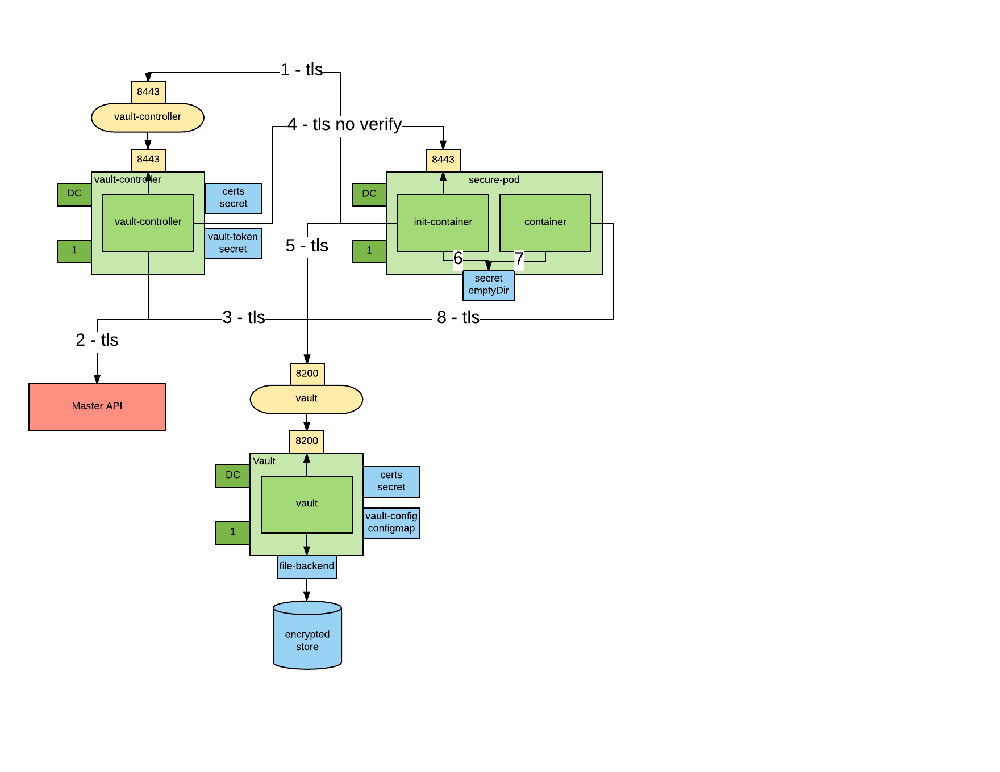

# Vault-based Credential Management Workflow

This project implements the workflow illustrated in the following picture



1. An Init container requests a wrapped token from the Vault Controller
2. The Vault Controller retrieves the Pod details from the Kubernetes API server
3. If the Pod exists and contains the `vaultproject.io/policies` annotation a unique wrapped token is generated for the Pod.
4. The Vault Controller "callsback" the Pod using the Pod IP obtained from the Kubernetes API.
5. The Init container unwraps the token to obtain a dedicated Vault token.
6. The dedicated token is written to a well-known location and the Init container exits.
7. Another container in the Pod reads the token from the token file.
8. Another container in the Pod renews the token to keep it from expiring.

This project is based on Kelsey Hightower Kubernetes - Vault integration [proof of concept](https://github.com/kelseyhightower/vault-controller)

# Motivation

There is a need to improve how credential are managed in Kubernetes. Credentials are supposed to be managed with secretes but secrets have some limitations. here is a secret threat model and relative needed security controls:

1. Secrets must be stored securely. Secrets should be encrypted when at rest.
2. Secrets must be transmitted securely among the platform components and the final consumer. Secrets should be encrypted when in transit.
3. Secrets should be visible only to subjects who have a need to know reason. In Kubernetes and Openshift it is relatively easy to get a view permission on secret, more granular control is needed there.
4. Secrets should not be accessible when in use. Today, because secrets are provisioned via a mounted file system, a node administrator can see all secrets of all pods running on that node. 

This orchestration attempts to mitigate all the above threats. See the detailed document for an in depth explanation.


# Improvements 

1. secure all connections with SSL - done
2. use an in memory emptyDir to not leave traces of the secret in the node filesystem - done
3. move the authorization labels to a custom API object so that the pod author cannot authorize his pods - in progress
4. support the case where the init-container retrieves the secret as opposed to just a wrapped token that can get the secret (for legacy apps that cannot be modified to talk to Vault - in progress
5. add a spring vault example(s) - in progress
6. refactor code to be more cloud friendly: single CLI with [cobra](https://github.com/spf13/cobra) CLI management and [viper](https://github.com/spf13/viper) properties management - done

# Requirements
You need the [Vault CLI](https://www.vaultproject.io/docs/install/) installed on your machine.

# Create a new project
```
oc new-project vault-controller
```

# Install Vault
```
oc adm policy add-scc-to-user anyuid -z default
oc create configmap vault-config --from-file=vault-config=./openshift/vault-config.json
oc create -f ./openshift/vault.yaml
oc create route passthrough vault --port=8200 --service=vault
```
# Initialize Vault
```
export VAULT_ADDR=https://`oc get route | grep -m1 vault | awk '{print $2}'`
vault init -tls-skip-verify -key-shares=1 -key-threshold=1
```
Save the generated key and token. 

# Unseal Vault.
 
You have to repeat this step every time you start vault. 

Don't try to automate this step, this is manual by design. 

You can make the initial seal stronger by increasing the number of keys. 

We will assume that the KEYS environment variable contains the key necessary to unseal the vault and that ROOT_TOKEN contains the root token.

For example:

`export KEYS=9++8KEDd72S3aGc0zaY9JW11tnQRDTEkCZWMHK2D0CM=`

`export ROOT_TOKEN=c30909da-a713-94bf-bf6e-46180ef79a64`

```
vault unseal -tls-skip-verify $KEYS
```

# Install Vault Controller

Deploy the vault controller
```
oc create secret generic vault-controller --from-literal vault-token=$ROOT_TOKEN
oc adm policy add-cluster-role-to-user view system:serviceaccount:vault-controller:default
oc create -f ./openshift/vault-controller.yaml
```
You can now start using this orchestration to provision secrets. See also the following examples:

1. [spring-based vault-aware application](./examples/spring-example/README.md)
2. [spring-based vault-unaware (legacy) application] (./examples/spring-legacy-example/README.md)

